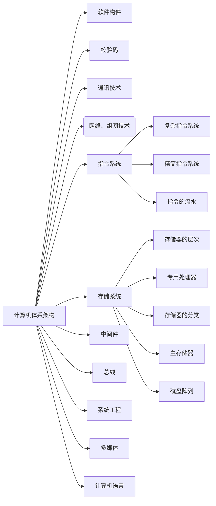
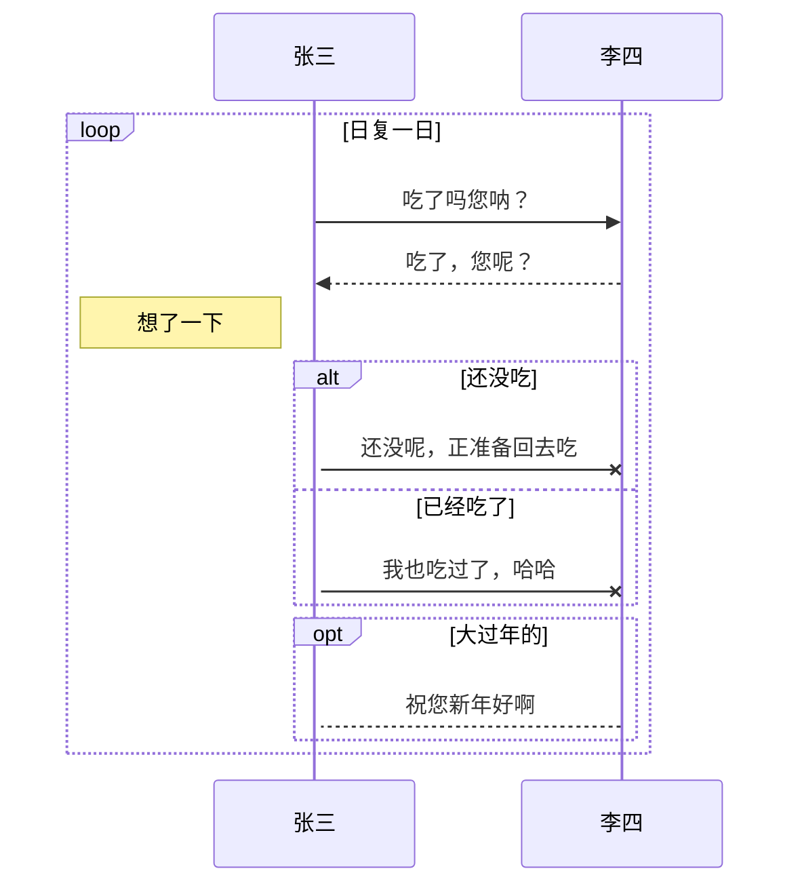

# 章节架构

```mermaid
graph LR
    计算机体系架构 --> 软件构件
    计算机体系架构 --> 校验码
    计算机体系架构 --> 通讯技术
    计算机体系架构 --> D(网络、组网技术)
    
    计算机体系架构 --> 指令系统
        指令系统 --> 复杂指令系统
        指令系统 --> 精简指令系统
        指令系统 --> 指令的流水
    
    计算机体系架构 --> 存储系统
        存储系统 --> 存储器的层次
        存储系统 --> 专用处理器
        存储系统 --> 存储器的分类
        存储系统 --> 主存储器
        存储系统 --> 磁盘阵列
    
    计算机体系架构 --> 中间件
    计算机体系架构 --> 总线
    计算机体系架构 --> 系统工程
    计算机体系架构 --> 多媒体
    计算机体系架构 --> 计算机语言

```

```mermaid
sequenceDiagram
    participant z as 张三
    participant l as 李四
    loop 日复一日
        z->>l: 吃了吗您呐？
        l-->>z: 吃了，您呢？
        activate z
        Note left of z: 想了一下
        alt 还没吃
            z-xl: 还没呢，正准备回去吃
        else 已经吃了
            z-xl: 我也吃过了，哈哈
        end
        opt 大过年的
            l-->z: 祝您新年好啊
        end
     end

```
